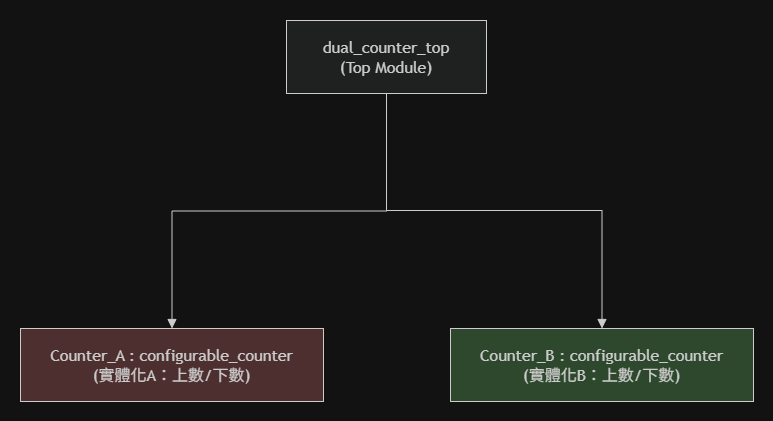
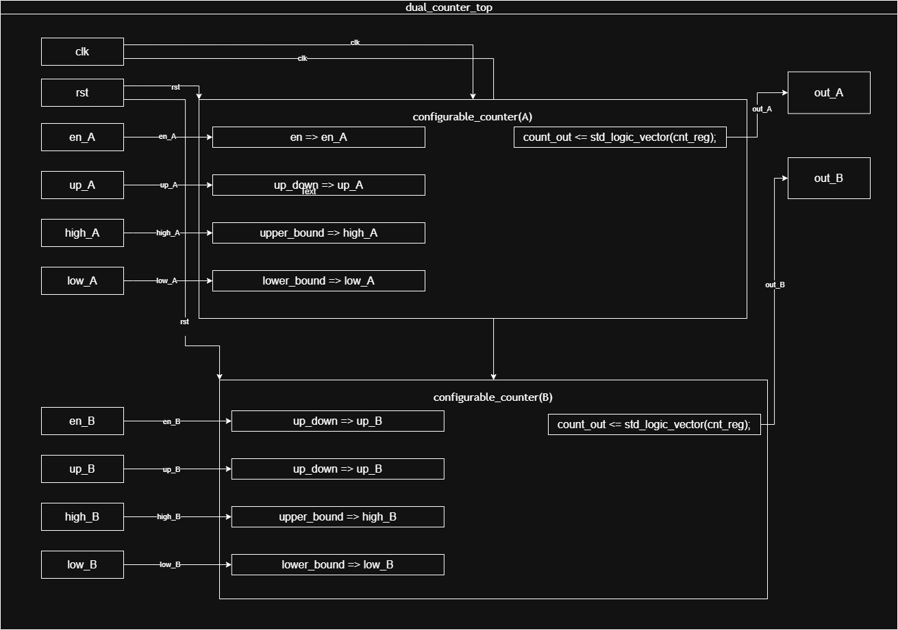
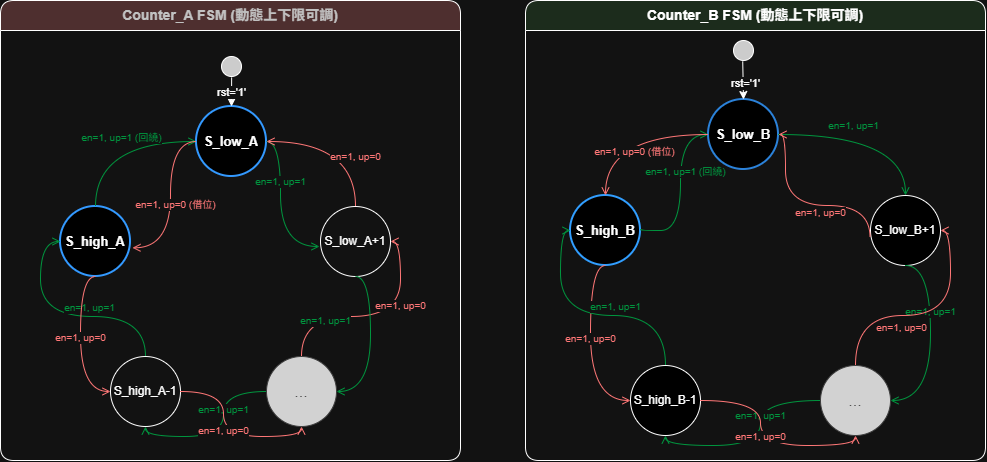
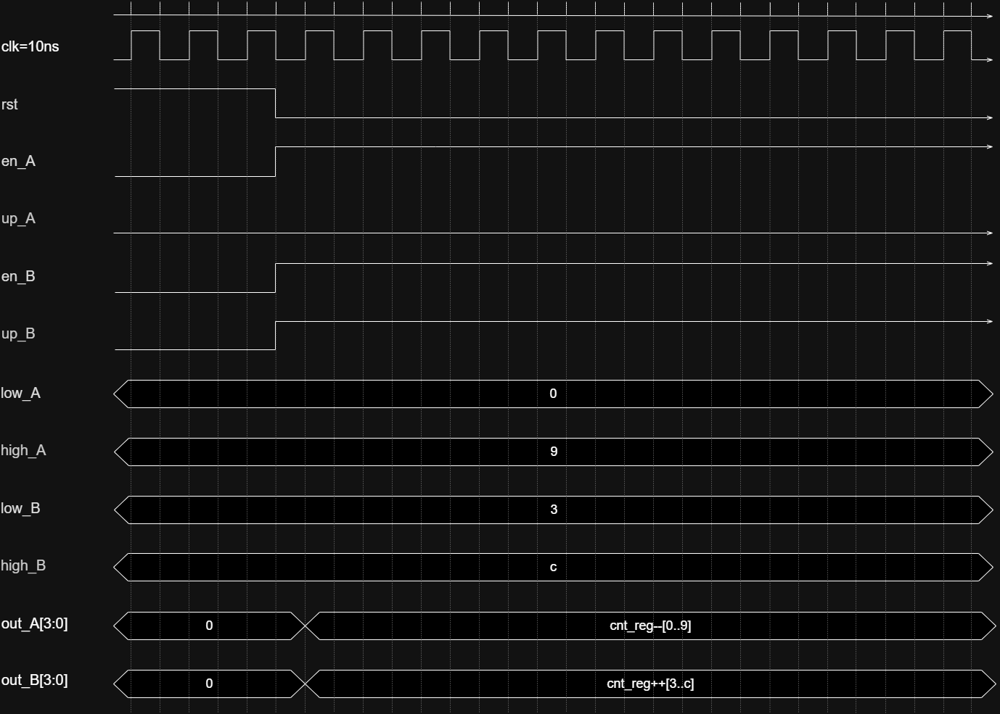
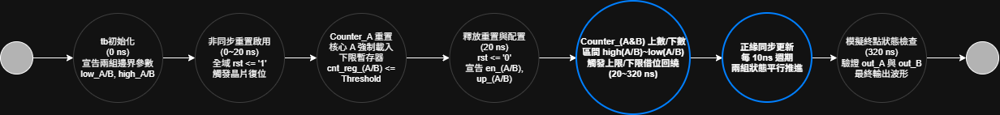

# Project 2: Dual Configurable Counters (雙獨立可配置計數器系統)

## 項目簡介 (Project Description)
本項目為 FPGA 數位電路設計之 **Project 2：設計兩個完全獨立且可動態配置的計數器系統**。

系統由一個頂層連接模組（Top Module）架接兩個相同架構的子模組計數器（Counter A & B）。這兩個計數器具備極高的硬體獨立性與並行處理能力，允許使用者透過外部輸入訊號，在不重新編譯電路且互不干擾的前提下，各別即時變更計數器 A 與 B 的計數範圍（上下限）、計數方向（上數/下數）以及啟動/暫停狀態。

---

## 1. 系統架構與模組階層 (System Architecture)

系統採用結構化設計（Structural Modeling），將功能切分為頂層控制與底層執行單元。以下為本系統的模組樹狀階層圖：

### 模組階層樹狀圖 (Module Hierarchy)

### 系統方塊圖與 RTL 電路圖 (Block Diagram)
在頂層模組中，Counter A 與 Counter B 的控制訊號（使能、方向、上下限）在硬體上被完全實體隔離，確保兩個計數器在同一個系統時脈驅動下可以 100% 並行運算、互不干擾。

---

## 2. 有限狀態機設計 (Finite State Machine, FSM)

為完美對齊「動態動態上下限可調」與「雙通道獨立運行」的硬體特性，本系統在邏輯映射上採用了**雙圈獨立可變 FSM 模型**。

* **動態邊界判定**：當計數值抵達或超出設定的上限或下限時，內部組合邏輯會自動執行 Wrap-around（歸繞）回到對應的起始點，防止數值溢位。
* **狀態硬體隔離**：兩組 FSM 各自維護獨立的計數暫存器與使能控制，即使兩者設定不同的範圍與方向（如同測試平台中的配置），依然能精確跳轉。

---

## 3. 時序規格藍圖 (Timing Specifications)

在進入實際模擬前，系統根據硬體規格定義了明確的時序響應期望值。下圖展示了系統時脈在 10ns (100MHz) 週期下，Counter A（0至9下數）與 Counter B（3至12上數）的理想波形跳轉時序藍圖。

---

## 4. 測試平台與模擬行為流程 (Testbench & Simulation Flow)

為驗證硬體邏輯的正確性，測試平台（`tb_dual_counter.vhd`）規劃了完整的生命週期驗證流程。下圖為該行為在時間軸上的運作節點（Activity-on-Node, AoV）：

### 測試平台核心配置
* **系統時脈**：產生週期為 10ns（頻率 100MHz）的系統時脈。
* **Counter A 配置**：`en_A = '1'`, `up_A = '0'`（反向下數），動態範圍設定為 `0000` 到 `1001` (0 至 9)。
* **Counter B 配置**：`en_B = '1'`, `up_B = '1'`（正向上數），動態範圍設定為 `0011` 到 `1100` (3 至 12，即十六進制的 3 至 c)。

---

## 5. 繞線後時序延遲分析 (Post-Routing Timing Analysis)

本專案除了進行基本的行為功能模擬外，進一步通過了 Vivado 的 **Post-Implementation Timing Simulation（實體佈線後時序模擬）**，以驗證電路在實際 FPGA 晶片硬體路徑上的真實表現。

### 功能模擬與時序模擬之對比

透過模擬波形比對，可以清楚觀察到理想硬體與真實硬體之間的關鍵差異：

| 評比項目 | Behavioral Simulation (功能模擬) | Post-Implementation Timing (繞線後時序模擬) |
| :--- | :--- | :--- |
| **延遲模型** | **零延遲 (Zero Delay)** 訊號變化與時脈正緣完全同步。 | **真實延遲 (Realistic Delay)** 包含邏輯閘延遲（Gate Delay）與連線延遲（Routing Delay）。 |
| **訊號觸發** | 當 `clk` 升起時，輸出值（`out_A`, `out_B`）在同一時間點瞬間完成切換（如 140.000ns）。 | 當 `clk` 升起後，輸出值需要經過一段傳播時間（Propagation Delay）才會完成轉變。 |
| **初始不確定態** | 模擬剛開始時，所有暫存器直接進入乾淨的初始值。 | 在重置訊號（`rst`）尚未穩定傳播、硬體尚未就緒前，輸出端會短暫出現**紅色不可知狀態（X 態）**。 |

### 真實硬體延遲觀測點

在繞線後的時序波形圖中（例如游標鎖定的 **264.600ns** 時間點）：

1. **傳播延遲顯現**：當前級時脈正緣（Rising Edge）升起後，輸出訊號 `out_A` 與 `out_B` 並非瞬間改變，而是存在微小的時間差（$T_{co}$，Clock-to-Output Delay）。這是因為訊號必須通過 FPGA 內部的查找表（LUT）與實際的金屬走線（Routing Net）。
2. **硬體穩健性驗證**：儘管動態配置的上下限比較邏輯較為複雜，但在 100MHz (10ns) 的時脈週期下，所有的資料建立時間（Setup Time）與保持時間（Hold Time）均未發生違規（Timing Violation），輸出波形無毛邊（Glitch），證明實體電路繞線後具備極高的穩定度。

---

## 6. 模擬環境與運行指引 (How to Run)

1. 將 `configurable_counter.vhd` 與 `dual_counter_top.vhd` 檔案加入至 Xilinx Vivado 專案的 **Design Sources** 中。
2. 將 `tb_dual_counter.vhd` 加入至 **Simulation Sources** 中。
3. 在 Vivado 左側選單點擊 **Run Simulation -> Run Behavioral Simulation** 觀察理想功能波形（對齊 Section 3 的時序規格藍圖）。
4. 點擊 **Run Simulation -> Run Post-Implementation Timing Simulation** 驗證實體佈線後的真實硬體時序與走線延遲。

> 💡 **波形觀察重點**：
> * 驗證 `out_A` 是否在 9 到 0 之間循環遞減（下數）；同時 `out_B` 在 3 到 12 (`c`) 之間循環遞增（上數），兩者完全獨立並行。
> * 在時序模擬中，放大時脈正緣處，確認輸出訊號在時脈上升後有正常的硬體繞線延遲（Propagation Delay）且無數位毛邊。
